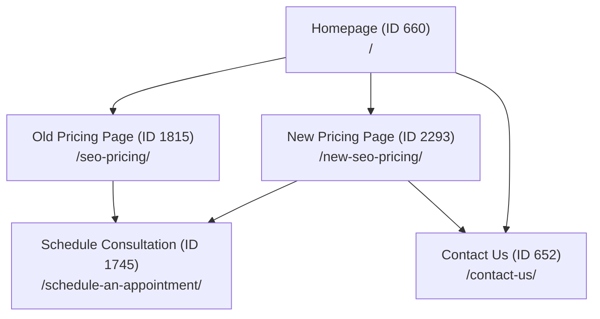

# PawRank.com — Master Technical & Operational Handbook

> **Last verified:** 2026-08-17  
> **Target website:** [https://pawrank.com/](https://pawrank.com/)  
> **Status:** Production / Active  

---

## 1. Project Overview

| Property | Value / Details |
| :--- | :--- |
| **Website Name** | Paw Rank |
| **Primary Domain** | `pawrank.com` (`https://pawrank.com/`) |
| **Business Purpose** | Specialized Veterinary Search Engine Optimization (SEO) & Digital Growth agency for independent and group veterinary practices. |
| **CMS** | WordPress 6.x |
| **Web Server / Host** | Hostinger (`31.170.166.160`, LiteSpeed/Apache + PHP 8.x + MySQL/MariaDB) |
| **Server Document Root** | `/home/u957110797/domains/pawrank.com/public_html/` |
| **SSH Access** | Port `65002`, user `u957110797`, key-based auth configured (`id_ed25519`) |
| **WP-CLI Status** | Fully operational on server via `wp-cli` command |
| **Active Theme** | **Neve** (`wp-content/themes/neve`) with **Neve Pro Addon** |
| **Page Builder** | **Elementor** (Free / Lite) + **Essential Addons for Elementor Lite** (`essential-addons-for-elementor-lite`) |
| **Key Plugins** | `seo-by-rank-math` (SEO), `pojo-accessibility` (Accessibility Toolbar), `ninja-forms` (Forms), `insert-headers-and-footers` (WPCode), `google-site-kit`, `microsoft-clarity`, `updraftplus` (Backups) |
| **Local Tooling** | Node.js v24.x, OpenSSH `ssh` / `scp` on Windows host |

---

## 2. Website Architecture & Page Map

PawRank is structured as a conversion-focused service website with dedicated marketing, pricing, scheduling, and trust pages.



### Complete Page Directory

| ID | Title | Slug / URL | Status | Role / Description | Design Reference? |
| :--- | :--- | :--- | :--- | :--- | :--- |
| **660** | Home | `406a7-home` (`/`) | Publish | Primary landing page with brand hero, value propositions, feature grids, and dark CTAs. | ⭐ **Primary Design Reference** |
| **652** | Contact Us | `contact-us` (`/contact-us/`) | Publish | Inquiry and plan-selection form page. | ⭐ **Secondary Reference (Forms)** |
| **1815** | Veterinary SEO Packages | `seo-pricing` (`/seo-pricing/`) | Publish | Original pricing page. Contains dark CTA banners and Essential Addons accordions. | ⭐ **Reference (Pricing & FAQ)** |
| **2293** | New SEO Pricing | `new-seo-pricing` (`/new-seo-pricing/`) | Publish | Redesigned high-converting SEO pricing page containing comprehensive billing timeline, 2-tier plans, comparison matrix, proof funnel, and 15-item FAQ accordion. | ⭐ **Full Component Showcase** |
| **1745** | Schedule an Appointment | `schedule-an-appointment` (`/schedule-an-appointment/`) | Publish | Primary booking target URL for all scheduling CTA buttons. | Conversion Target |
| **2054** | Your Last Veterinary SEO Company: Paw Rank | `your-last-veterinary-seo-company-paw-rank` | Publish | Long-form authority article. | Content Page |
| **1790** | Veterinary SEO Blogs | `blogs` (`/blogs/`) | Publish | Blog archive page. | Blog Archive |
| **1543** | Privacy Policy | `privacy-policy` (`/privacy-policy/`) | Publish | Legal / privacy policy. | Legal |
| **10** | Elementor Default Kit | — | Internal | Global Elementor styles and Neve color token bindings. | System Kit |

---

## 3. WordPress & Elementor Technical Architecture

### 3.1 Where Page Data is Stored
* **Post Content:** Stored in `wp_posts.post_content` (often empty or legacy HTML when Elementor is active).
* **Elementor Structure:** Stored in `wp_postmeta` under meta key `_elementor_data` as a JSON-encoded string.
* **Elementor Edit Mode:** Stored in `wp_postmeta` under `_elementor_edit_mode = 'builder'`.

### 3.2 Elementor JSON Conventions
The `_elementor_data` JSON structure is an array of section/container objects:
```json
[
  {
    "id": "7-char-hex",
    "elType": "section",
    "settings": { ... },
    "elements": [
      {
        "id": "7-char-hex",
        "elType": "column",
        "elements": [
          {
            "id": "7-char-hex",
            "elType": "widget",
            "widgetType": "html",
            "settings": { "html": "<section id='pawrank-...'>...</section>" }
          }
        ]
      }
    ]
  }
]
```

### 3.3 Free Elementor Strategy: Scoped Custom HTML/CSS Widgets
Because **Elementor Free** does not allow custom CSS per widget:
1. High-fidelity custom sections are implemented using `widgetType: "html"` with scoped `<style>` tags.
2. Every section uses an isolated ID or root class (e.g. `#pawrank-transparency`, `#pawrank-pricing`, `#pawrank-billing`, `#pawrank-comparison`, `#pawrank-proof`, `#pawrank-faq`, `#pawrank-final-cta`).
3. Inside each section, CSS variables link to PawRank's brand tokens (`--blue: #325CE8`, `--navy: #0B2845`, `--chalk: #F7F7F3`, `--white: #FFFFFF`, `--black: #121212`, `--text: #4A6080`).

### 3.4 CSS Invalidation & Regeneration Procedure
When modifying `_elementor_data` in the database, Elementor's statically generated CSS files must be cleared and rebuilt:
```php
// 1. Delete cached postmeta
delete_post_meta($post_id, '_elementor_css');
delete_post_meta($post_id, '_elementor_page_assets');

// 2. Clear Elementor internal files cache
if (class_exists('\Elementor\Plugin')) {
    \Elementor\Plugin::$instance->files_manager->clear_cache();
}

// 3. Re-generate Post CSS
if (class_exists('\Elementor\Core\Files\CSS\Post')) {
    $css_file = new \Elementor\Core\Files\CSS\Post($post_id);
    $css_file->update();
}
```

---

## 4. Safe Development Rules

> [!IMPORTANT]
> **Production Safety Principles:**
> 1. **Always Backup Before Modifying:** Export `_elementor_data` to a server backup file (e.g., `/home/u957110797/domains/pawrank.com/backup_*.json`) before updating post meta.
> 2. **Never Edit Global Theme Header/Footer Directly:** The global header and footer are controlled via the Neve customizer and menu locations (`nav_menu_locations`). Do not alter site-wide header/footer files unless explicitly instructed.
> 3. **Keep Third-Party Widgets Intact:** The site uses WhatsApp chat (`.wa__popup_chat_open`) and Pojo Accessibility (`.pojo-a11y-toolbar-toggle`). Do not remove or break these scripts; ensure page designs account for their fixed overlay positions.
> 4. **Scope All Custom CSS:** Never write un-namespaced rules like `h2 { color: red; }` or `p { margin: 0; }` that could leak outside the page container.

---

## 5. Content Integrity Rules

PawRank's copy is highly specialized veterinary SEO messaging. When performing redesigns:

* **DO NOT** rewrite, summarize, paraphrase, shorten, or remove copy.
* **DO NOT** change pricing amounts ($750 setup, $1,250 setup, $995/month, $1,695/month).
* **DO NOT** delete disclaimers, editorial notes, or FAQ items.
* **DO** visually transform raw text into cards, steppers, feature grids, comparison tables, and accordions while keeping all sentences verbatim.

---

## 6. Standard Development Procedures

### Procedure A: Inspecting & Downloading a Page's Elementor Tree
```powershell
# Extract JSON via WP-CLI on server
ssh -o StrictHostKeyChecking=no -p 65002 u957110797@31.170.166.160 "cd /home/u957110797/domains/pawrank.com/public_html && wp-cli post meta get <PAGE_ID> _elementor_data" > page_raw.json
```

### Procedure B: Deploying Updates via SCP + WP-CLI Script
```powershell
# 1. Transfer updated JSON and update script
scp -o StrictHostKeyChecking=no -P 65002 new_elementor_data.json u957110797@31.170.166.160:/home/u957110797/domains/pawrank.com/new_elementor_data.json
scp -o StrictHostKeyChecking=no -P 65002 apply_update.php u957110797@31.170.166.160:/home/u957110797/domains/pawrank.com/apply_update.php

# 2. Execute update and regenerate CSS via WP-CLI
ssh -o StrictHostKeyChecking=no -p 65002 u957110797@31.170.166.160 "cd /home/u957110797/domains/pawrank.com/public_html && wp-cli eval-file /home/u957110797/domains/pawrank.com/apply_update.php"
```

### Procedure C: Quality Assurance (QA) Checklist
Every modified page must be validated against:
1. **Desktop Viewport (1280px+):** Verify vertical rhythm, card alignments, button hover states, and color contrast.
2. **Mobile Viewport (375px):** Verify single-column stacking, zero horizontal overflow, touch-target sizes (minimum 44px height for buttons).
3. **Interactive Components:** Verify accordion expand/collapse, tab click handlers, and modal behaviors.
4. **Links & Navigation:** Verify all primary CTA buttons point to `https://pawrank.com/schedule-an-appointment/` and secondary links point to `https://pawrank.com/contact-us/`.
5. **Content Verification:** Run a node verification script comparing source strings against final assembled JSON.

---

## 7. Known Gotchas & Technical Solutions

| Problem / Gotcha | Cause | Verified Solution |
| :--- | :--- | :--- |
| **PowerShell SSH Quote Stripping** | PowerShell evaluates `$` inside double quotes before passing the command to SSH. | Write PHP scripts to standalone files, transfer via `scp`, and execute using `wp-cli eval-file`. |
| **Command Line Length Limits** | Passing large JSON strings directly via CLI fails due to Windows 8192-character buffer limit. | Always transfer data files via `scp` rather than shell arguments. |
| **Stale Elementor CSS Cache** | Updating `_elementor_data` postmeta directly leaves old static CSS files in `wp-content/uploads/elementor/css/`. | Must delete `_elementor_css` postmeta and call `\Elementor\Plugin::$instance->files_manager->clear_cache()` followed by `Post::update()`. |
| **WhatsApp Widget Overlay** | WhatsApp popup auto-expands and blocks above-the-fold hero content on load. | Ensure popup starts minimized (`.wa__popup_chat_open { display: none !important; }`). |
| **Accessibility Toolbar Overlap** | Pojo accessibility icon in bottom-left overlaps content at smaller viewport heights. | Maintain bottom margins/padding on page containers so fixed widgets don't obscure text. |

---

## 8. Documentation History

* **2026-08-17:** Initial PawRank master technical handbook created after complete architectural discovery, SSH/WP-CLI automation setup, and redesign of `https://pawrank.com/new-seo-pricing/` (Post ID 2293).
